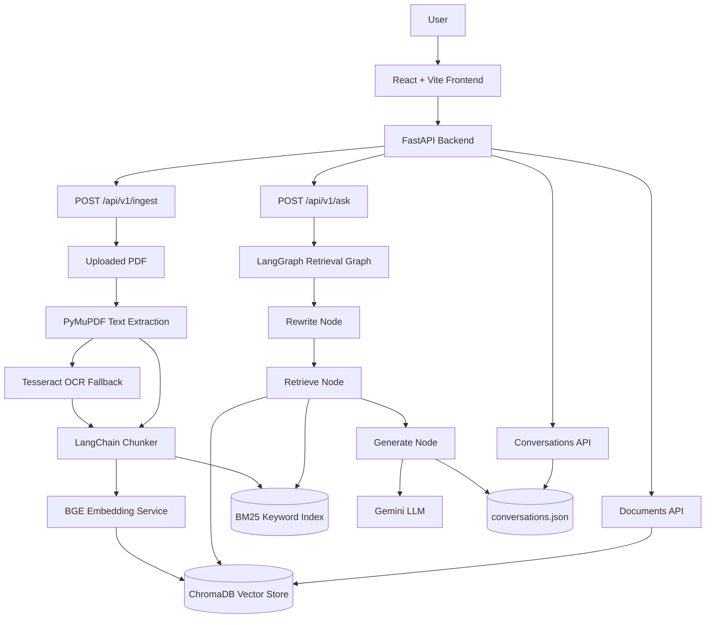
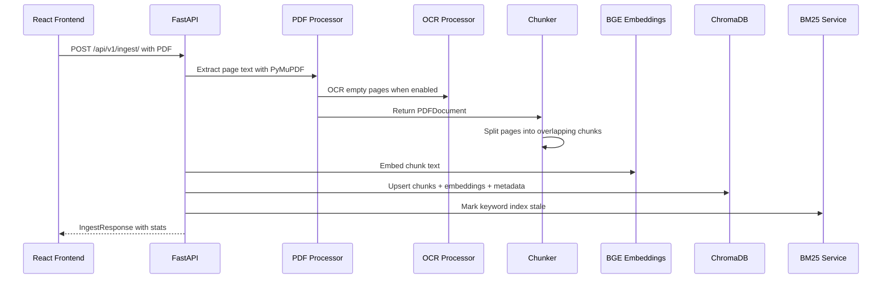
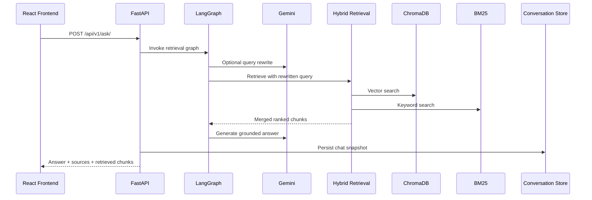

# DocuIntel

AI-powered document intelligence for uploading PDFs, extracting text with OCR fallback, indexing content, and chatting with citations.


## Overview

DocuIntel is a full-stack Retrieval-Augmented Generation (RAG) application for working with PDF documents. Users upload PDFs through a React interface, the backend extracts text from each page, applies OCR when pages are scanned or image-based, chunks the text, embeds it with a local BGE embedding model, stores vectors in ChromaDB, and answers natural-language questions using Gemini with source citations.

The project was built to solve a common document workflow problem: PDF files often contain valuable information, but searching, comparing, and asking follow-up questions across them is slow. DocuIntel turns PDFs into searchable, conversational knowledge sources.

Target users include students, researchers, analysts, engineers, and teams that need to query reports, resumes, papers, manuals, policy documents, or scanned PDFs with a transparent citation trail.

## Features

- PDF upload from a drag-and-drop React interface.
- Automatic text extraction with PyMuPDF.
- OCR fallback for scanned or image-heavy pages using Tesseract via `pytesseract`.
- Configurable chunking with overlap using LangChain text splitters.
- Local BGE embeddings through `BAAI/bge-small-en-v1.5`.
- Persistent vector storage in ChromaDB.
- Hybrid retrieval that combines semantic vector search and BM25 keyword search.
- Optional query rewriting with Gemini for better follow-up question retrieval.
- LangGraph-based retrieval pipeline with `rewrite -> retrieve -> generate` nodes.
- Gemini-powered answer generation with document context and chat history.
- Source citations with filename, page number, excerpt, and confidence score.
- Document list, PDF preview, and highlighted retrieved chunks in the frontend.
- Per-document question filtering.
- Chat history persistence in `backend/data/conversations.json`.
- Backend health checks with vector DB, BM25, OCR, Gemini, and session status.
- Delete documents and associated vector chunks from the UI/API.
- Vite proxy setup for local frontend/backend development.
- Structured JSON logging for backend observability.

## Architecture / System Design

DocuIntel has three main layers:

1. Frontend: a React/Vite/Tailwind app that handles PDF upload, document browsing, chat, PDF preview, source rendering, and local session state.
2. Backend API: a FastAPI service that exposes ingestion, question answering, document management, conversation persistence, and health endpoints.
3. AI and storage pipeline: PyMuPDF/Tesseract extract text, LangChain chunks content, BGE creates embeddings, ChromaDB stores vectors, BM25 indexes keywords, LangGraph orchestrates retrieval and answer generation with Gemini.



### Ingestion Flow



### Question Answering Flow



## Tech Stack

| Category | Technologies |
| --- | --- |
| Frontend | React 18, Vite 5, Tailwind CSS 3, Axios, Lucide React, React Markdown, React PDF, PDF.js, UUID |
| Backend | Python, FastAPI, Uvicorn, Pydantic, Pydantic Settings, Python Multipart |
| Database | ChromaDB persistent local vector store, JSON file conversation persistence |
| Machine Learning / AI | BAAI BGE-small embeddings, Sentence Transformers, PyTorch, LangChain, LangGraph, Gemini via `google-genai`, BM25 via `rank-bm25` |
| DevOps | Local virtual environment, npm scripts, Vite dev server proxy, `.env` configuration, structured JSON logs |
| Cloud Services | Google Gemini API for query rewriting and answer generation |
| Other Tools & Libraries | PyMuPDF for PDF parsing, Tesseract OCR through `pytesseract`, Pillow, pdf2image optional fallback, NumPy |

## Project Structure

```text
docuintelligence/
├── README.md
├── requirements.txt
├── .env.example
├── .gitignore
├── backend.zip
├── frontend.zip
├── backend/
│   ├── main.py
│   ├── main_backup.py
│   ├── config.py
│   ├── api/
│   │   └── routes/
│   │       ├── ask.py
│   │       ├── ask_backup.py
│   │       ├── conversations.py
│   │       ├── documents.py
│   │       └── ingest.py
│   ├── graph/
│   │   ├── retrieval_graph.py
│   │   ├── state.py
│   │   └── nodes/
│   │       ├── generate.py
│   │       ├── retrieve.py
│   │       └── rewrite.py
│   ├── ingestion/
│   │   ├── chunker.py
│   │   ├── ocr_processor.py
│   │   └── pdf_processor.py
│   ├── memory/
│   │   └── conversation_manager.py
│   ├── services/
│   │   ├── bm25_service.py
│   │   ├── conversation_store.py
│   │   ├── embedding_service.py
│   │   ├── hybrid_retrieval_service.py
│   │   ├── llm_service.py
│   │   ├── retrieval_service.py
│   │   └── vector_store.py
│   ├── utils/
│   │   └── logger.py
│   └── data/
│       ├── conversations.json
│       ├── uploads/
│       └── chroma_db/
└── frontend/
    ├── package.json
    ├── package-lock.json
    ├── vite.config.js
    ├── tailwind.config.js
    ├── postcss.config.js
    ├── index.html
    ├── public/
    │   └── favicon.svg
    └── src/
        ├── App.jsx
        ├── main.jsx
        ├── index.css
        ├── api/
        │   └── client.js
        ├── components/
        │   ├── ChatArea.jsx
        │   ├── ChatHistory.jsx
        │   ├── ChatInput.jsx
        │   ├── DocumentList.jsx
        │   ├── LoadingAnimation.jsx
        │   ├── MessageBubble.jsx
        │   ├── PdfPreviewPanel.jsx
        │   ├── Sidebar.jsx
        │   ├── SourceCard.jsx
        │   ├── TopBar.jsx
        │   └── UploadSection.jsx
        ├── hooks/
        │   ├── useBackendStatus.js
        │   ├── useChat.js
        │   └── useDocuments.js
        └── utils/
            └── helpers.js
```

### Important Files

| Path | Purpose |
| --- | --- |
| `backend/main.py` | FastAPI app entrypoint, CORS setup, router registration, health endpoint |
| `backend/config.py` | Central settings loaded from `.env` |
| `backend/api/routes/ingest.py` | PDF upload, extraction, chunking, embedding, vector storage |
| `backend/api/routes/ask.py` | Question answering endpoint and response model |
| `backend/api/routes/documents.py` | Document list, PDF file streaming, document deletion |
| `backend/api/routes/conversations.py` | Persistent chat history CRUD API |
| `backend/graph/retrieval_graph.py` | LangGraph graph assembly |
| `backend/graph/nodes/*.py` | Query rewrite, hybrid retrieval, answer generation nodes |
| `backend/services/hybrid_retrieval_service.py` | Combines vector and BM25 retrieval scores |
| `backend/services/vector_store.py` | ChromaDB wrapper |
| `backend/services/llm_service.py` | Gemini client, prompts, answer generation, query rewriting |
| `frontend/src/App.jsx` | Main app shell and state orchestration |
| `frontend/src/api/client.js` | Axios client and frontend API functions |
| `frontend/src/components/PdfPreviewPanel.jsx` | PDF display and retrieved text highlighting |
| `frontend/vite.config.js` | Vite dev server and `/api` + `/health` proxy to backend |

## Installation

### Prerequisites

- Python 3.11 recommended.
- Node.js 18+ recommended.
- npm.
- Tesseract OCR installed if `OCR_ENABLED=true`.
- A Google Gemini API key for answering questions.
- Enough disk space for Python packages, PyTorch, the embedding model, ChromaDB files, and uploaded PDFs.

Install Tesseract:

```bash
# Ubuntu/Debian
sudo apt-get install tesseract-ocr

# macOS
brew install tesseract

# Windows
# Install from: https://github.com/UB-Mannheim/tesseract/wiki
```

Verify:

```bash
tesseract --version
```

### Environment Setup

```bash
git clone <Needs User Input: repository URL>
cd docuintelligence
python -m venv venv
```

Activate the virtual environment:

```bash
# Windows PowerShell
.\venv\Scripts\Activate.ps1

# Windows cmd
venv\Scripts\activate

# macOS/Linux
source venv/bin/activate
```

### Backend Dependency Installation

```bash
pip install -r requirements.txt
```

If CPU-only PyTorch installation is preferred:

```bash
pip install torch==2.3.1 --index-url https://download.pytorch.org/whl/cpu
pip install -r requirements.txt
```

### Frontend Dependency Installation

```bash
cd frontend
npm install
cd ..
```

### Configuration Steps

Create backend environment configuration:

```bash
# macOS/Linux
cp .env.example backend/.env

# Windows PowerShell
Copy-Item .env.example backend\.env
```

Edit `backend/.env` and set at least:

```env
GEMINI_API_KEY=your_google_gemini_api_key
```

The backend loads `.env` relative to the backend working directory. The recommended backend command below runs from `backend/`, so `backend/.env` is the expected location.

## Usage

### Run the Backend

```bash
cd backend
uvicorn main:app --reload --port 8000
```

Backend services:

- API root: `http://localhost:8000`
- Swagger UI: `http://localhost:8000/docs`
- Health check: `http://localhost:8000/health`

### Run the Frontend

Open a second terminal:

```bash
cd frontend
npm run dev
```

Frontend app:

```text
http://localhost:5173
```

The Vite dev server proxies `/api/**` and `/health` to `http://localhost:8000`.

### Common Workflows

1. Start the backend.
2. Start the frontend.
3. Open `http://localhost:5173`.
4. Upload a PDF from the left sidebar.
5. Wait for extraction, OCR if needed, chunking, embedding, and storage.
6. Ask a question in the chat input.
7. Expand source cards to inspect citations.
8. Open the PDF preview to view the original document and highlighted chunks.
9. Select a specific document to restrict retrieval to that document.
10. Use chat history to restore previous conversations.

### Example: Health Check

```bash
curl http://localhost:8000/health
```

Example response:

```json
{
  "status": "ok",
  "app": "DocuIntel",
  "version": "0.4.0",
  "phase": "React Frontend + OCR + Hybrid RAG + Memory + Chat Persistence",
  "embedding_model": "BAAI/bge-small-en-v1.5",
  "llm_model": "gemini-2.5-flash",
  "gemini_key_configured": true,
  "query_rewriting_enabled": true,
  "hybrid_weights": {
    "semantic": 0.6,
    "bm25": 0.4
  },
  "vector_db": {
    "status": "ok",
    "collection_name": "documents",
    "total_chunks": 0,
    "persist_dir": "./data/chroma_db"
  },
  "bm25_index": {
    "documents_indexed": 0
  },
  "memory": {
    "active_sessions": 0
  },
  "ocr": {
    "status": "ok",
    "enabled": true,
    "language": "eng",
    "dpi": 300
  }
}
```

### Example: Upload a PDF

```bash
curl -X POST http://localhost:8000/api/v1/ingest/ \
  -F "file=@/path/to/document.pdf"
```

Example response:

```json
{
  "status": "success",
  "message": "Successfully ingested 'document.pdf' - 42 chunks stored.",
  "filename": "document.pdf",
  "doc_id": "document_pdf",
  "total_pages": 10,
  "extractable_pages": 10,
  "total_chunks": 42,
  "chunks_stored": 42,
  "needs_ocr": false,
  "upload_timestamp": "2026-06-03T10:30:00.000000+00:00",
  "processing_time_ms": 3241.5,
  "vector_store_total": 42,
  "page_stats": [
    {
      "page_num": 1,
      "char_count": 1842,
      "is_empty": false,
      "ocr_applied": false
    }
  ],
  "ocr_pages_count": 0,
  "ocr_applied": false
}
```

### Example: Ask a Question

```bash
curl -X POST http://localhost:8000/api/v1/ask/ \
  -H "Content-Type: application/json" \
  -d '{
    "question": "Summarise the main findings.",
    "session_id": "demo-session",
    "doc_id": "document_pdf"
  }'
```

Example response:

```json
{
  "question": "Summarise the main findings.",
  "answer": "The document's main findings are ...",
  "sources": [
    {
      "filename": "document.pdf",
      "page": 2,
      "chunk_id": "document_pdf_3",
      "excerpt": "The report states that ...",
      "score": 0.82
    }
  ],
  "chunks_retrieved": 5,
  "processing_time_ms": 1432,
  "timestamp": "2026-06-03T10:32:00.000000+00:00",
  "rewritten_query": "main findings document",
  "session_id": "demo-session",
  "doc_id_filter": "document_pdf",
  "retrieved_chunks": [
    {
      "chunk_id": "document_pdf_3",
      "text": "The report states that ...",
      "page_num": 2,
      "filename": "document.pdf",
      "score": 0.82
    }
  ]
}
```

## Configuration

Configuration is defined in `backend/config.py` and loaded from `.env`.

| Variable | Default | Description |
| --- | --- | --- |
| `APP_NAME` | `DocuIntel` | Application display name. |
| `APP_VERSION` | `0.4.0` | Version returned by `/health`. |
| `DEBUG` | `false` | Debug flag for app configuration. |
| `LOG_LEVEL` | `INFO` | Backend logging level. |
| `UPLOAD_DIR` | `./data/uploads` | Directory where uploaded PDFs are stored. |
| `CHROMA_PERSIST_DIR` | `./data/chroma_db` | ChromaDB persistence directory. |
| `CONVERSATION_STORE_PATH` | `./data/conversations.json` | JSON file for persisted chat history. |
| `EMBEDDING_MODEL_NAME` | `BAAI/bge-small-en-v1.5` | Hugging Face embedding model. |
| `EMBEDDING_DEVICE` | `cpu` | Embedding device, usually `cpu` or a GPU device if configured. |
| `EMBEDDING_BATCH_SIZE` | `32` | Batch size for document embeddings. |
| `CHUNK_SIZE` | `800` | Maximum character length for text chunks. |
| `CHUNK_OVERLAP` | `150` | Character overlap between adjacent chunks. |
| `CHROMA_COLLECTION_NAME` | `documents` | ChromaDB collection name. |
| `RETRIEVAL_TOP_K` | `5` | Legacy semantic retrieval top-k setting. |
| `VECTOR_TOP_K` | `10` | Number of vector candidates for hybrid retrieval. |
| `BM25_TOP_K` | `10` | Number of BM25 candidates for hybrid retrieval. |
| `SEMANTIC_WEIGHT` | `0.6` | Weight for vector score in hybrid ranking. |
| `BM25_WEIGHT` | `0.4` | Weight for BM25 score in hybrid ranking. |
| `GEMINI_API_KEY` | empty | Required for Gemini query rewriting and answer generation. |
| `GEMINI_MODEL` | `gemini-2.5-flash` | Gemini model used by the LLM service. |
| `ENABLE_QUERY_REWRITING` | `true` | Enables Gemini-powered standalone query rewriting. |
| `MAX_MEMORY_TURNS` | `5` | Number of prior user/assistant turns included in prompts. |
| `OCR_ENABLED` | `true` | Enables OCR fallback for low-text pages. |
| `OCR_LANGUAGE` | `eng` | Tesseract language code. |
| `OCR_DPI` | `300` | PDF render DPI for OCR. |
| `RERANK_TOP_N` | `5` | Configured rerank top-N value; no separate reranker service is currently present. |

### Frontend Configuration

`frontend/vite.config.js` defines:

| Setting | Value |
| --- | --- |
| Dev server port | `5173` |
| `/api` proxy target | `http://localhost:8000` |
| `/health` proxy target | `http://localhost:8000` |
| Optimized dependency | `react-pdf` |

### CORS

The backend currently allows:

- `http://localhost:5173`
- `http://localhost:5174`
- `http://127.0.0.1:5173`
- `http://127.0.0.1:5174`

## API Documentation

Base URL for local development:

```text
http://localhost:8000
```

Interactive Swagger documentation:

```text
http://localhost:8000/docs
```

### GET `/`

Returns a minimal API status message.

Request:

```bash
curl http://localhost:8000/
```

Response:

```json
{
  "message": "DocuIntel API is running.",
  "docs": "http://localhost:8000/docs",
  "health": "http://localhost:8000/health"
}
```

### GET `/health`

Returns backend, vector database, BM25, memory, Gemini, and OCR status.

Request:

```bash
curl http://localhost:8000/health
```

Response format:

```json
{
  "status": "ok",
  "app": "DocuIntel",
  "version": "0.4.0",
  "phase": "React Frontend + OCR + Hybrid RAG + Memory + Chat Persistence",
  "embedding_model": "BAAI/bge-small-en-v1.5",
  "llm_model": "gemini-2.5-flash",
  "gemini_key_configured": true,
  "query_rewriting_enabled": true,
  "hybrid_weights": {
    "semantic": 0.6,
    "bm25": 0.4
  },
  "vector_db": {
    "status": "ok",
    "collection_name": "documents",
    "total_chunks": 0,
    "persist_dir": "./data/chroma_db"
  },
  "bm25_index": {
    "documents_indexed": 0
  },
  "memory": {
    "active_sessions": 0
  },
  "ocr": {
    "status": "ok",
    "enabled": true,
    "language": "eng",
    "dpi": 300
  }
}
```

### POST `/api/v1/ingest/`

Uploads and ingests a PDF.

Request format:

- Content type: `multipart/form-data`
- Field: `file`
- Accepted files: `.pdf`

Example request:

```bash
curl -X POST http://localhost:8000/api/v1/ingest/ \
  -F "file=@/path/to/document.pdf"
```

Response format:

```json
{
  "status": "success",
  "message": "Successfully ingested 'document.pdf' - 42 chunks stored.",
  "filename": "document.pdf",
  "doc_id": "document_pdf",
  "total_pages": 10,
  "extractable_pages": 10,
  "total_chunks": 42,
  "chunks_stored": 42,
  "needs_ocr": false,
  "upload_timestamp": "2026-06-03T10:30:00.000000+00:00",
  "processing_time_ms": 3241.5,
  "vector_store_total": 42,
  "page_stats": [
    {
      "page_num": 1,
      "char_count": 1842,
      "is_empty": false,
      "ocr_applied": false
    }
  ],
  "ocr_pages_count": 0,
  "ocr_applied": false
}
```

Possible errors:

| Status | Cause |
| --- | --- |
| `400` | Missing filename or non-PDF upload. |
| `422` | Invalid or corrupted PDF. |
| `500` | Save, extraction, chunking, embedding, or storage failure. |

### POST `/api/v1/ask/`

Asks a question about ingested documents.

Request format:

```json
{
  "question": "What are the key points?",
  "session_id": "optional-existing-session-id",
  "doc_id": "optional-document-id-filter"
}
```

Field rules:

| Field | Type | Required | Notes |
| --- | --- | --- | --- |
| `question` | string | Yes | 3 to 2000 characters. |
| `session_id` | string | No | Generated automatically if omitted. |
| `doc_id` | string | No | Restricts retrieval to one document. |

Example request:

```bash
curl -X POST http://localhost:8000/api/v1/ask/ \
  -H "Content-Type: application/json" \
  -d '{"question":"What does this document say about methodology?","session_id":"demo"}'
```

Response format:

```json
{
  "question": "What does this document say about methodology?",
  "answer": "The document describes ...",
  "sources": [
    {
      "filename": "document.pdf",
      "page": 3,
      "chunk_id": "document_pdf_5",
      "excerpt": "The methodology section explains ...",
      "score": 0.77
    }
  ],
  "chunks_retrieved": 5,
  "processing_time_ms": 1520,
  "timestamp": "2026-06-03T10:35:00.000000+00:00",
  "rewritten_query": "methodology document",
  "session_id": "demo",
  "doc_id_filter": null,
  "retrieved_chunks": [
    {
      "chunk_id": "document_pdf_5",
      "text": "The methodology section explains ...",
      "page_num": 3,
      "filename": "document.pdf",
      "score": 0.77
    }
  ]
}
```

Possible errors:

| Status | Cause |
| --- | --- |
| `422` | Question too short, too long, or invalid request shape. |
| `503` | `GEMINI_API_KEY` is missing. |
| `500` | Retrieval graph or LLM generation failure. |

### GET `/api/v1/documents/`

Lists ingested documents aggregated from ChromaDB chunk metadata.

Example request:

```bash
curl http://localhost:8000/api/v1/documents/
```

Response format:

```json
{
  "documents": [
    {
      "doc_id": "document_pdf",
      "filename": "document.pdf",
      "total_pages": 10,
      "chunk_count": 42,
      "ocr_applied": false,
      "upload_timestamp": "2026-06-03T10:30:00.000000+00:00"
    }
  ],
  "total": 1
}
```

### GET `/api/v1/documents/{doc_id}/file`

Streams the original uploaded PDF file.

Example request:

```bash
curl -L http://localhost:8000/api/v1/documents/document_pdf/file --output document.pdf
```

Response:

- Content type: `application/pdf`
- Content disposition: inline PDF filename without timestamp prefix

Possible errors:

| Status | Cause |
| --- | --- |
| `404` | `doc_id` not found or uploaded PDF missing from disk. |
| `500` | ChromaDB lookup failed or invalid file metadata. |

### DELETE `/api/v1/documents/{doc_id}`

Deletes a document, its uploaded PDF file, and all associated ChromaDB chunks. Marks the BM25 index stale.

Example request:

```bash
curl -X DELETE http://localhost:8000/api/v1/documents/document_pdf
```

Response format:

```json
{
  "status": "deleted",
  "doc_id": "document_pdf",
  "chunks_deleted": 42,
  "file_deleted": true,
  "file_warning": null
}
```

### GET `/api/v1/conversations/`

Lists saved conversation summaries.

Example request:

```bash
curl http://localhost:8000/api/v1/conversations/
```

Response format:

```json
{
  "conversations": [
    {
      "session_id": "demo",
      "title": "What are the key points?",
      "created_at": "2026-06-03T10:30:00.000000+00:00",
      "updated_at": "2026-06-03T10:35:00.000000+00:00",
      "message_count": 2,
      "selected_document": null,
      "selected_document_name": null
    }
  ],
  "total": 1
}
```

### GET `/api/v1/conversations/{session_id}`

Returns a full saved conversation.

Example request:

```bash
curl http://localhost:8000/api/v1/conversations/demo
```

Response format:

```json
{
  "session_id": "demo",
  "title": "What are the key points?",
  "created_at": "2026-06-03T10:30:00.000000+00:00",
  "updated_at": "2026-06-03T10:35:00.000000+00:00",
  "messages": [],
  "selected_document": null,
  "preview_document": null,
  "retrieved_sources": [],
  "highlights": []
}
```

### PUT `/api/v1/conversations/{session_id}`

Creates or updates a saved conversation snapshot.

Request format:

```json
{
  "session_id": "demo",
  "title": "Conversation title",
  "messages": [],
  "selected_document": null,
  "preview_document": null,
  "retrieved_sources": [],
  "highlights": []
}
```

Example request:

```bash
curl -X PUT http://localhost:8000/api/v1/conversations/demo \
  -H "Content-Type: application/json" \
  -d '{"session_id":"demo","title":"Conversation title","messages":[]}'
```

Response:

Returns the saved conversation object.

Possible errors:

| Status | Cause |
| --- | --- |
| `400` | Path `session_id` does not match body `session_id`. |

### DELETE `/api/v1/conversations/{session_id}`

Deletes a saved conversation.

Example request:

```bash
curl -X DELETE http://localhost:8000/api/v1/conversations/demo
```

Response format:

```json
{
  "status": "deleted",
  "session_id": "demo"
}
```

## Machine Learning Details

### Dataset Information

DocuIntel does not include a training dataset. It builds a retrieval index from user-uploaded PDFs stored under `backend/data/uploads/` and vectors under `backend/data/chroma_db/`.

The repository currently contains local generated/user data, including ChromaDB files and `backend/data/conversations.json`. These are runtime artifacts, not curated benchmark datasets.

### Data Preprocessing

1. Validate uploaded file is a PDF.
2. Save the file with a timestamp prefix to avoid name collisions.
3. Extract page text with PyMuPDF.
4. If a page has fewer than 50 characters and OCR is enabled, render it at `OCR_DPI` and process it with Tesseract.
5. Normalize whitespace and OCR output.
6. Split page text into recursive character chunks.
7. Attach metadata:
   - `chunk_id`
   - `doc_id`
   - `filename`
   - `page_num`
   - `total_pages`
   - `chunk_index`
   - `position_in_page`
   - `upload_timestamp`
   - `char_count`
   - `doc_type`
   - `has_ocr`

### Model Architecture

DocuIntel is a RAG system rather than a trained model.

| Component | Role |
| --- | --- |
| `BAAI/bge-small-en-v1.5` | Local embedding model for documents and queries. |
| ChromaDB HNSW index | Approximate nearest neighbor vector search. |
| BM25Okapi | Keyword retrieval for exact terms, acronyms, names, and section labels. |
| Gemini | Query rewriting and grounded answer generation. |
| LangGraph | Deterministic orchestration of rewrite, retrieval, and generation nodes. |

### Training Pipeline

There is no model training pipeline in this repository. The system uses pretrained models and indexes uploaded documents at ingestion time.

### Evaluation Metrics

No formal evaluation scripts or benchmark metrics are present in the repository. Needs User Input if benchmark accuracy, retrieval precision, hallucination rate, or latency targets should be documented.

### Inference Pipeline

1. Receive user question and optional `doc_id`.
2. Load recent chat history for the session.
3. Optionally rewrite the question into a standalone retrieval query.
4. Run hybrid retrieval:
   - vector search with BGE embeddings and ChromaDB
   - BM25 keyword search over indexed chunks
   - score normalization and weighted merge
5. Build context from top retrieved chunks.
6. Generate an answer with Gemini using context and recent conversation history.
7. Return answer, citations, scores, and retrieved chunks.
8. Persist the turn to the in-memory conversation manager and JSON conversation store.

## Screenshots / Demo

Add screenshots in this section before publishing.

Suggested screenshots:

| Screenshot | Description |
| --- | --- |
| `docs/screenshots/upload.png` | PDF upload and document sidebar. |
| `docs/screenshots/chat.png` | Chat answer with source cards. |
| `docs/screenshots/pdf-preview.png` | PDF preview with highlighted retrieved chunks. |
| `docs/screenshots/health.png` | Backend health/status view or Swagger health response. |

Suggested demo GIF:

```text
docs/demo/docuintel-demo.gif
```

Demo script:

1. Start backend and frontend.
2. Upload a text PDF.
3. Ask "Summarise the main findings."
4. Expand citations.
5. Open PDF preview.
6. Ask a follow-up question.

## Performance

Runtime performance depends on PDF size, OCR usage, CPU/GPU availability, and Gemini latency.

Observed or inferable characteristics from the code:

| Operation | Expected Behavior |
| --- | --- |
| First embedding call | May take longer because the BGE model is downloaded/loaded. |
| Text PDF ingestion | Usually faster than scanned PDF ingestion because OCR is skipped. |
| Scanned PDF ingestion | Slower due to page rendering and Tesseract OCR. |
| Retrieval | Uses ChromaDB vector search plus BM25 merge. |
| BM25 index | Built lazily on first retrieval and rebuilt after ingest/delete when marked stale. |
| Frontend health polling | Every 30 seconds. |
| API timeout from frontend | 120 seconds in `frontend/src/api/client.js`. |

Resource requirements:

- CPU works by default.
- GPU can be used for embeddings if PyTorch and `EMBEDDING_DEVICE` are configured accordingly.
- Tesseract is required for OCR.
- ChromaDB storage grows with number and size of uploaded PDFs.

Benchmarks and accuracy metrics: Needs User Input. No benchmark scripts are currently present.

## Testing

No dedicated automated test suite is present in the repository at the time of this README.

### Manual Backend Checks

```bash
cd backend
uvicorn main:app --reload --port 8000
```

```bash
curl http://localhost:8000/health
```

```bash
curl -X POST http://localhost:8000/api/v1/ingest/ \
  -F "file=@/path/to/document.pdf"
```

```bash
curl -X POST http://localhost:8000/api/v1/ask/ \
  -H "Content-Type: application/json" \
  -d '{"question":"What is this document about?"}'
```

### Frontend Build Check

```bash
cd frontend
npm run build
```

### Suggested Future Tests

- Backend unit tests for PDF extraction, OCR fallback, chunking, and metadata generation.
- API tests for all FastAPI routes.
- Retrieval tests with controlled documents and expected source pages.
- Frontend component tests for upload, chat, document list, and source rendering.
- End-to-end tests for upload -> ask -> cite -> preview workflow.

## Deployment

### Local Deployment

Run backend and frontend separately:

```bash
# Terminal 1
cd backend
uvicorn main:app --reload --port 8000
```

```bash
# Terminal 2
cd frontend
npm run dev
```

### Production Deployment

No production deployment files are currently present. There is no Dockerfile, docker-compose file, reverse proxy config, or CI/CD workflow in the repository.

Recommended production approach:

1. Build frontend:

   ```bash
   cd frontend
   npm run build
   ```

2. Serve `frontend/dist` with a static host or reverse proxy.
3. Run FastAPI behind a production ASGI server setup:

   ```bash
   cd backend
   uvicorn main:app --host 0.0.0.0 --port 8000
   ```

4. Put a reverse proxy such as Nginx or Caddy in front of the backend.
5. Store `.env` secrets outside version control.
6. Use persistent storage volumes for:
   - uploaded PDFs
   - ChromaDB persistence
   - conversation JSON store
7. Restrict CORS origins to the production frontend domain.
8. Add authentication before exposing private documents.

### Docker Instructions

Docker is not currently configured. Needs User Input if Docker support should be added.

Suggested future files:

```text
Dockerfile.backend
Dockerfile.frontend
docker-compose.yml
```

### CI/CD Workflow

No CI/CD workflow is present. Needs User Input for preferred platform, such as GitHub Actions, GitLab CI, Azure Pipelines, or Render/Railway/Vercel deployment hooks.

## Dependencies

### Backend Dependencies

| Library | Why It Is Used |
| --- | --- |
| `fastapi` | HTTP API framework. |
| `uvicorn[standard]` | ASGI server for FastAPI. |
| `python-multipart` | Multipart PDF upload handling. |
| `pydantic`, `pydantic-settings` | Request/response models and `.env` settings. |
| `python-dotenv` | Environment variable loading support. |
| `PyMuPDF` | PDF parsing and page rendering. |
| `langchain`, `langchain-core`, `langchain-community` | Document primitives and integration utilities. |
| `langchain-text-splitters` | Recursive character chunking. |
| `langchain-huggingface` | Hugging Face embedding integration. |
| `langgraph` | Graph-based RAG orchestration. |
| `sentence-transformers` | Embedding model runtime. |
| `torch` | ML tensor/model backend. |
| `chromadb` | Persistent vector database. |
| `google-genai` | Gemini API client. |
| `rank-bm25` | Keyword retrieval. |
| `numpy` | Numeric operations for retrieval scoring. |
| `pytesseract` | Python wrapper around Tesseract OCR. |
| `Pillow` | Image processing for OCR. |
| `pdf2image` | Optional PDF-to-image fallback dependency. |

### Frontend Dependencies

| Library | Why It Is Used |
| --- | --- |
| `react`, `react-dom` | Frontend UI. |
| `vite` | Development server and production build. |
| `tailwindcss`, `postcss`, `autoprefixer` | Styling pipeline. |
| `axios` | HTTP client with centralized error handling. |
| `lucide-react` | Icon system. |
| `react-markdown`, `remark-gfm` | Markdown rendering for AI answers. |
| `react-pdf`, `pdfjs-dist` | PDF preview and text layer rendering. |
| `uuid` | Session and message IDs. |

## Roadmap

Planned or recommended improvements:

- Add authentication and user-level document isolation.
- Add Docker and docker-compose deployment.
- Add automated tests for backend, frontend, and retrieval behavior.
- Add CI/CD workflow.
- Add benchmark datasets for retrieval quality and answer faithfulness.
- Add streaming responses from the backend to the frontend.
- Add document metadata editing and tagging.
- Add multi-document comparison mode.
- Add reranking service if `RERANK_TOP_N` is intended to be used.
- Add support for DOCX, TXT, Markdown, HTML, and image uploads.
- Add admin controls for clearing ChromaDB and conversation history.
- Add production logging, metrics, and tracing.
- Add screenshot and demo assets.

## Known Limitations

- No authentication or authorization is implemented.
- Uploaded documents are stored locally on disk.
- Conversation persistence uses a JSON file, which is simple but not ideal for high-concurrency production use.
- ChromaDB is local and persistent, but not configured for distributed deployment.
- OCR requires an external Tesseract installation.
- OCR quality depends on scan quality, DPI, page layout, and installed language packs.
- Query rewriting uses an additional Gemini request when enabled, which increases latency and API usage.
- No automated test suite is currently present.
- No Docker or CI/CD configuration is currently present.
- No formal accuracy or latency benchmark is included.
- Existing `.zip`, ChromaDB, upload, and conversation files are runtime/generated artifacts and should be reviewed before publishing to a public repository.
- The repository does not include a license file.

## Contributing

Contributions are welcome once the repository owner confirms the contribution policy.

Recommended development workflow:

1. Create a feature branch.
2. Install backend and frontend dependencies.
3. Run the backend and frontend locally.
4. Make focused changes.
5. Run manual checks and `npm run build`.
6. Update documentation when behavior changes.
7. Open a pull request with:
   - summary of changes
   - screenshots for UI changes
   - API examples for backend changes
   - testing notes

Suggested branch naming:

```text
feature/<short-description>
fix/<short-description>
docs/<short-description>
```

Pull request checklist:

- [ ] Code is scoped and readable.
- [ ] README/API docs are updated if needed.
- [ ] No secrets are committed.
- [ ] Generated artifacts are excluded unless intentionally needed.
- [ ] Backend starts successfully.
- [ ] Frontend builds successfully.
- [ ] PDF upload and ask flow are manually verified.

## Troubleshooting

### Backend Cannot Find `GEMINI_API_KEY`

Symptom:

```text
Gemini API key is not configured.
```

Fix:

```bash
Copy-Item .env.example backend\.env
```

Then edit `backend/.env`:

```env
GEMINI_API_KEY=your_key_here
```

Start the backend from the `backend/` directory:

```bash
cd backend
uvicorn main:app --reload --port 8000
```

### Frontend Says Backend Is Offline

Fix:

```bash
cd backend
uvicorn main:app --reload --port 8000
```

Then refresh `http://localhost:5173`.

### Tesseract Not Found

Symptom:

```text
Tesseract binary not found
```

Fix:

- Install Tesseract.
- Ensure `tesseract --version` works in the terminal.
- Restart the backend.

### `ModuleNotFoundError: No module named 'fitz'`

`fitz` is provided by PyMuPDF.

Fix:

```bash
pip install PyMuPDF==1.24.5
```

### `pydantic_settings` Not Found

Fix:

```bash
pip install pydantic-settings==2.7.1
```

### First Embedding Call Is Slow

The BGE model may download and load on first use. Later runs should use the local model cache.

### Upload Returns `422 Unprocessable Entity`

Common causes:

- File is not a valid PDF.
- File is corrupted.
- Request field is not named `file`.
- Content type is not multipart form data.

### OCR Produces Poor Text

Try:

- Increasing `OCR_DPI`.
- Using a higher-quality scan.
- Installing the correct Tesseract language pack.
- Setting `OCR_LANGUAGE` to the right language code.

### No Documents Appear After Upload

Check:

- Backend logs for ingestion errors.
- `/health` for ChromaDB status.
- `CHROMA_PERSIST_DIR` points to the expected location.
- The frontend is calling the same backend instance where the PDF was uploaded.

### Same PDF Uploaded Twice

Chunk IDs are derived from the filename-based `doc_id` and chunk index. ChromaDB uses upsert, so identical chunk IDs update existing chunks rather than duplicating them.

## FAQ

### Does DocuIntel train a custom model?

No. It uses pretrained embeddings, ChromaDB retrieval, BM25 keyword search, and Gemini generation.

### Can it process scanned PDFs?

Yes, when `OCR_ENABLED=true` and Tesseract is installed.

### Does it work without a Gemini API key?

PDF ingestion and indexing can work, but question answering requires Gemini for generation. Query rewriting also requires Gemini when enabled.

### Where are uploaded PDFs stored?

By default, in `backend/data/uploads`.

### Where are vectors stored?

By default, in `backend/data/chroma_db`.

### Where is chat history stored?

By default, in `backend/data/conversations.json`.

### Can I ask questions about one specific document?

Yes. The frontend can select a document, and the backend supports an optional `doc_id` filter in `/api/v1/ask/`.

### Can I delete documents?

Yes. `DELETE /api/v1/documents/{doc_id}` removes ChromaDB chunks, attempts to delete the uploaded PDF, and marks the BM25 index stale.

### Is this production-ready?

It has a production-style architecture, but production deployment still needs authentication, secrets management, persistent volumes, Docker or process management, CI/CD, monitoring, and stronger data isolation.

## License

Needs User Input.

No `LICENSE` file was found in the repository. Add a license before publishing or accepting external contributions.

## Authors / Credits

Author: Needs User Input.

Acknowledgements:

- FastAPI and Uvicorn for the backend API.
- React, Vite, and Tailwind CSS for the frontend.
- LangChain and LangGraph for RAG workflow primitives.
- ChromaDB for local vector persistence.
- BAAI for the `bge-small-en-v1.5` embedding model.
- Google Gemini for answer generation and query rewriting.
- PyMuPDF and Tesseract OCR for PDF text extraction.

## References

- FastAPI documentation: https://fastapi.tiangolo.com/
- React documentation: https://react.dev/
- Vite documentation: https://vitejs.dev/
- Tailwind CSS documentation: https://tailwindcss.com/
- ChromaDB documentation: https://docs.trychroma.com/
- LangChain documentation: https://python.langchain.com/
- LangGraph documentation: https://langchain-ai.github.io/langgraph/
- Google Gen AI SDK: https://ai.google.dev/gemini-api/docs/sdks
- BGE embedding models: https://huggingface.co/BAAI/bge-small-en-v1.5
- PyMuPDF documentation: https://pymupdf.readthedocs.io/
- Tesseract OCR documentation: https://tesseract-ocr.github.io/
- BM25 overview: https://en.wikipedia.org/wiki/Okapi_BM25
