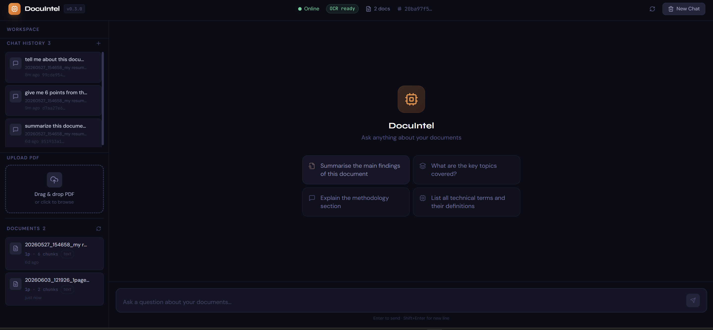
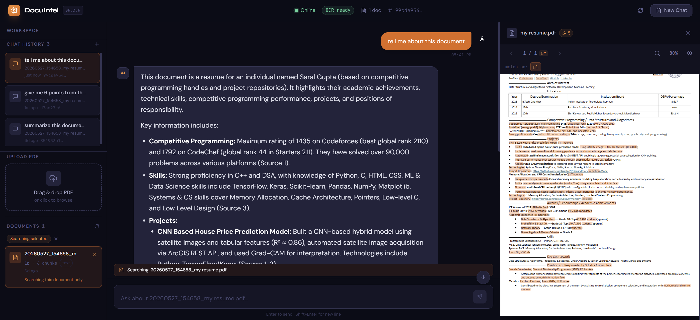
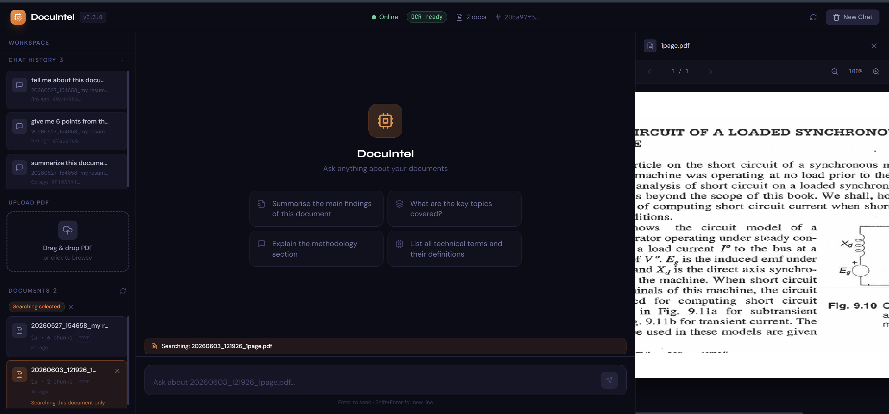
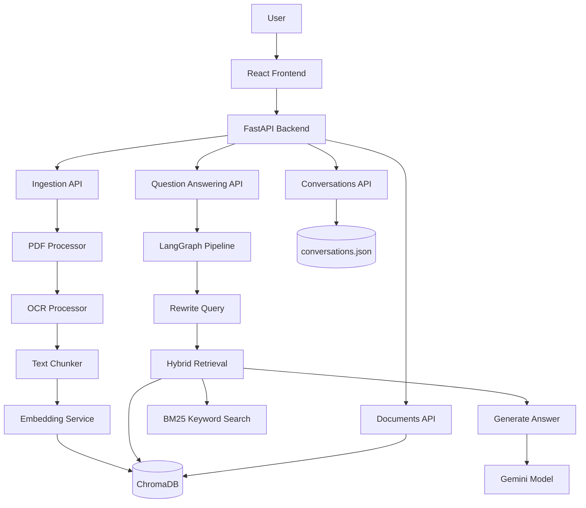
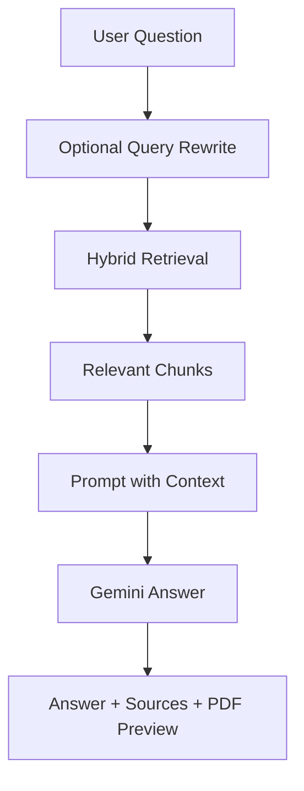

# DocuIntel

Your documents, turned into a searchable AI workspace.


> Screenshot note: the README references the three product screenshots shared for this project. Save them in `docs/screenshots/` with the filenames used below before publishing on GitHub.

<p align="center">
  
</p>

## Project Story

DocuIntel is an AI document intelligence app that lets users upload PDFs and ask questions about them in plain English.

Instead of manually reading long reports, resumes, scanned notes, academic papers, or technical PDFs, the user can upload a document, let the system understand it, and then chat with it. The app does not just give an answer; it also shows where the answer came from by displaying source pages, excerpts, and PDF previews.

The project was built to solve a very real problem: documents contain useful information, but finding the right detail quickly is painful. DocuIntel turns static PDFs into an interactive knowledge workspace.

## What Makes It Useful

| Feature | What It Means for the User |
| --- | --- |
| Ask questions about PDFs | The user can talk to a document instead of manually searching through pages. |
| PDF upload workspace | Drag and drop documents directly from the UI. |
| OCR support | Scanned PDFs and image-heavy pages can still be processed. |
| Smart retrieval | The system searches by meaning and by exact keywords. |
| Source-backed answers | Answers include citations, page numbers, and excerpts. |
| PDF preview | Users can inspect the original document beside the answer. |
| Document-focused search | Users can choose one document and ask only about that file. |
| Chat history | Previous conversations remain available in the sidebar. |
| Local vector database | Document chunks are stored persistently in ChromaDB. |
| Clean product UI | The interface feels like a real AI workspace, not just an API demo. |

## Visual Feature Highlights

### 1. Workspace for Uploading and Asking

<p align="center">
  
</p>

The main screen is designed around three simple actions:

- upload a PDF
- select a document
- ask a question

The left sidebar keeps the workspace organized with chat history, document upload, and uploaded document cards. The center panel gives suggested prompts such as summaries, key topics, methodology explanations, and technical term extraction.

### 2. AI Answers with Source Context

<p align="center">
  
</p>

The user asks a question, and DocuIntel responds with a structured answer. The right side shows the original PDF, so users can verify the answer without leaving the app.

This is important because AI answers are more trustworthy when users can see the document evidence behind them.

### 3. Search One Document at a Time

<p align="center">
  
</p>

DocuIntel can search across all uploaded documents or focus on one selected file. This is useful when the user has many documents but wants answers from one specific source.

## Core Features

- Document upload through a polished React interface.
- Automatic PDF text extraction.
- OCR fallback for scanned or low-text pages.
- Document chunking for better retrieval.
- Local embeddings using `BAAI/bge-small-en-v1.5`.
- Persistent vector storage with ChromaDB.
- Hybrid search using both semantic similarity and BM25 keyword matching.
- Gemini-powered answer generation.
- Query rewriting for better follow-up questions.
- LangGraph workflow for a clean AI pipeline.
- Source cards with filename, page number, excerpt, and score.
- PDF preview panel with document navigation and highlights.
- Chat history and conversation restore.
- Document delete support.
- Backend health status for OCR, Gemini, ChromaDB, and memory.

## How the Project Works

DocuIntel follows a simple idea:

> Upload a PDF -> understand the content -> store it in searchable form -> answer questions with evidence.

### The Pipeline in Plain English

1. The user uploads a PDF.
2. The backend reads the PDF page by page.
3. If a page has little or no readable text, OCR tries to read it like an image.
4. The extracted text is split into smaller meaningful chunks.
5. Each chunk is converted into a numerical representation called an embedding.
6. Chunks and embeddings are stored in ChromaDB.
7. When the user asks a question, the system finds the most relevant chunks.
8. Gemini uses those chunks to generate an answer.
9. The frontend shows the answer with sources and the original PDF preview.


## System Design

DocuIntel is made of three main parts:

| Layer | What It Does |
| --- | --- |
| Frontend | The user interface for uploading PDFs, chatting, seeing history, and previewing documents. |
| Backend | The FastAPI service that handles uploads, search, document management, and chat APIs. |
| AI pipeline | The document processing, OCR, embeddings, retrieval, and answer generation system. |



## Why Hybrid Search Matters

A normal search system may fail when the wording of the question is different from the document. A pure AI similarity search may miss exact terms like names, codes, dates, or section numbers.

DocuIntel combines both:

| Search Type | Good At |
| --- | --- |
| Semantic search | Understanding meaning, concepts, and paraphrased questions. |
| BM25 keyword search | Finding exact words, names, numbers, acronyms, and technical terms. |

Together they make retrieval stronger and more reliable.

## Tech Stack

### Frontend

- React
- Vite
- Tailwind CSS
- Axios
- React PDF
- React Markdown
- Lucide React

### Backend

- FastAPI
- Uvicorn
- Pydantic
- Python Multipart
- JSON structured logging

### AI and Machine Learning

- Gemini for answer generation and query rewriting
- BGE small embeddings for local vector representation
- LangGraph for the AI workflow
- LangChain text splitters
- BM25 keyword search

### Document Processing

- PyMuPDF for PDF parsing
- Tesseract OCR through `pytesseract`
- Pillow for image handling

### Storage

- ChromaDB for vector storage
- Local uploaded PDF folder
- `conversations.json` for chat persistence

## Project Structure

```text
docuintelligence/
├── backend/
│   ├── main.py                     # FastAPI app entry point
│   ├── config.py                   # Runtime configuration
│   ├── api/routes/                 # API endpoints
│   │   ├── ingest.py               # PDF upload and ingestion
│   │   ├── ask.py                  # Question answering
│   │   ├── documents.py            # List, preview, delete documents
│   │   └── conversations.py        # Chat history persistence
│   ├── ingestion/                  # PDF parsing, OCR, chunking
│   ├── graph/                      # LangGraph RAG workflow
│   ├── services/                   # Embeddings, retrieval, vector DB, LLM
│   ├── memory/                     # In-memory chat history
│   ├── utils/                      # Logging helpers
│   └── data/                       # Runtime uploads, vectors, conversations
│
├── frontend/
│   ├── src/
│   │   ├── App.jsx                 # Main app shell
│   │   ├── api/client.js           # Frontend API client
│   │   ├── components/             # UI building blocks
│   │   ├── hooks/                  # Frontend state hooks
│   │   └── utils/                  # UI helpers
│   ├── package.json                # Frontend dependencies and scripts
│   └── vite.config.js              # Vite dev server and API proxy
│
├── requirements.txt                # Backend dependencies
├── .env.example                    # Environment variable template
└── README.md
```

## Installation

### Prerequisites

- Python 3.11 recommended
- Node.js 18 or newer
- npm
- Tesseract OCR installed
- Gemini API key

### 1. Clone the Repository

```bash
git clone <Needs User Input: repository URL>
cd docuintelligence
```

### 2. Create a Python Virtual Environment

```bash
python -m venv venv
```

Activate it:

```bash
# Windows PowerShell
.\venv\Scripts\Activate.ps1

# macOS/Linux
source venv/bin/activate
```

### 3. Install Backend Dependencies

```bash
pip install -r requirements.txt
```

### 4. Configure Environment Variables

```bash
# Windows PowerShell
Copy-Item .env.example backend\.env

# macOS/Linux
cp .env.example backend/.env
```

Add your Gemini key inside `backend/.env`:

```env
GEMINI_API_KEY=your_api_key_here
```

### 5. Install Frontend Dependencies

```bash
cd frontend
npm install
```

## Running the Project

Start the backend:

```bash
cd backend
uvicorn main:app --reload --port 8000
```

Start the frontend in another terminal:

```bash
cd frontend
npm run dev
```

Open:

```text
http://localhost:5173
```

Backend docs:

```text
http://localhost:8000/docs
```

## Usage

### Upload a Document

Use the left sidebar to drag and drop a PDF. DocuIntel will process it and add it to the document list.

### Ask a Question

Examples:

- "Summarise the main findings of this document."
- "What are the key topics covered?"
- "Explain the methodology section."
- "List the technical terms and their definitions."
- "Give me six important points from this PDF."

### Focus on One Document

Select a document from the sidebar. The chat input will show that DocuIntel is searching only inside that selected file.

### Verify the Answer

Open the PDF preview panel and compare the AI answer with the highlighted source content.

## API Summary

The project includes a complete FastAPI backend. The most important endpoints are:

| Method | Route | Purpose |
| --- | --- | --- |
| `GET` | `/` | Basic API status. |
| `GET` | `/health` | Backend, OCR, Gemini, vector DB, and memory health. |
| `POST` | `/api/v1/ingest/` | Upload and process a PDF. |
| `POST` | `/api/v1/ask/` | Ask a question about uploaded documents. |
| `GET` | `/api/v1/documents/` | List uploaded documents. |
| `GET` | `/api/v1/documents/{doc_id}/file` | Stream the original PDF. |
| `DELETE` | `/api/v1/documents/{doc_id}` | Delete a document and its stored chunks. |
| `GET` | `/api/v1/conversations/` | List chat history. |
| `GET` | `/api/v1/conversations/{session_id}` | Restore one conversation. |
| `PUT` | `/api/v1/conversations/{session_id}` | Save a conversation snapshot. |
| `DELETE` | `/api/v1/conversations/{session_id}` | Delete a conversation. |

Example question request:

```bash
curl -X POST http://localhost:8000/api/v1/ask/ \
  -H "Content-Type: application/json" \
  -d '{
    "question": "Tell me about this document",
    "session_id": "demo-session"
  }'
```

Example upload request:

```bash
curl -X POST http://localhost:8000/api/v1/ingest/ \
  -F "file=@/path/to/document.pdf"
```

## Configuration

Key settings are controlled through `backend/.env`.

| Variable | Meaning |
| --- | --- |
| `GEMINI_API_KEY` | Required for AI answer generation. |
| `GEMINI_MODEL` | Gemini model used by the backend. |
| `UPLOAD_DIR` | Where uploaded PDFs are stored. |
| `CHROMA_PERSIST_DIR` | Where ChromaDB stores vectors. |
| `EMBEDDING_MODEL_NAME` | Embedding model used for document search. |
| `CHUNK_SIZE` | Size of each document text chunk. |
| `CHUNK_OVERLAP` | Overlap between chunks for better context. |
| `VECTOR_TOP_K` | Number of semantic search matches. |
| `BM25_TOP_K` | Number of keyword search matches. |
| `SEMANTIC_WEIGHT` | Importance of semantic search. |
| `BM25_WEIGHT` | Importance of keyword search. |
| `ENABLE_QUERY_REWRITING` | Rewrites follow-up questions into clearer search queries. |
| `MAX_MEMORY_TURNS` | Number of recent chat turns included in the prompt. |
| `OCR_ENABLED` | Enables OCR for scanned PDFs. |
| `OCR_LANGUAGE` | Tesseract language code. |
| `OCR_DPI` | Image quality used while OCR reads PDF pages. |

## Machine Learning and AI Details

DocuIntel is not a model training project. It is a RAG system.

That means it uses existing AI models and a retrieval pipeline:

- BGE embeddings convert text into searchable vectors.
- ChromaDB stores and searches those vectors.
- BM25 improves exact keyword matching.
- Gemini writes the final answer using retrieved document context.
- LangGraph controls the order of the AI steps.

### Data Used

The system uses PDFs uploaded by the user. There is no fixed training dataset in the repository.

### Inference Pipeline



## Performance Notes

- Text-based PDFs process faster than scanned PDFs.
- Scanned PDFs take longer because OCR must read the page image.
- The first embedding call may be slower because the model loads for the first time.
- BM25 is rebuilt lazily after upload or delete, so startup remains lightweight.
- Frontend requests use a 120-second timeout for large document processing.

Formal benchmarks and accuracy metrics are not included yet.

## Testing

There is no dedicated automated test suite yet.

Recommended manual checks:

```bash
curl http://localhost:8000/health
```

```bash
cd frontend
npm run build
```

Then test the full workflow:

1. Upload a PDF.
2. Ask a question.
3. Expand sources.
4. Open the PDF preview.
5. Select one document and ask again.
6. Restore a previous chat from history.

## Future Work

- This project has not been deployed yet.
- Add deployment support in the future.
- Add Docker support.
- Add authentication and user accounts.
- Add a proper database for conversations instead of only JSON persistence.
- Add automated backend and frontend tests.
- Add streaming AI responses.
- Add support for DOCX, TXT, Markdown, images, and web pages.
- Add document tags and folders.
- Add multi-document comparison.
- Add evaluation metrics for retrieval quality.
- Add screenshots and demo GIF files directly into the repository.

## Known Limitations

- No authentication is currently implemented.
- The app currently stores uploaded files locally.
- OCR quality depends on scan quality and Tesseract language support.
- Gemini API access is required for answers.
- No formal benchmark report is included yet.
- The project is currently designed for local development.
- The repository does not include a license file yet.

## Troubleshooting

### Backend is Offline

Start the backend:

```bash
cd backend
uvicorn main:app --reload --port 8000
```

### Gemini Key Missing

Add this to `backend/.env`:

```env
GEMINI_API_KEY=your_api_key_here
```

### Tesseract Not Found

Install Tesseract and verify:

```bash
tesseract --version
```

### PDF Upload Fails

Check that:

- the file is actually a PDF
- the request field name is `file`
- the backend is running
- the PDF is not corrupted

### First Query is Slow

The embedding model may be loading for the first time. Later queries should be faster.

## FAQ

### Can DocuIntel read scanned PDFs?

Yes. If OCR is enabled and Tesseract is installed, it can process scanned or image-based pages.

### Does it train a custom AI model?

No. It uses pretrained embeddings, retrieval, and Gemini for answer generation.

### Can it answer from only one document?

Yes. Select a document from the sidebar and the app searches only that file.

### Where are documents stored?

Uploaded PDFs are stored locally in `backend/data/uploads`.

### Where are vector embeddings stored?

They are stored in ChromaDB under `backend/data/chroma_db`.

### Is the project deployed?

No. The project has not been deployed yet. Deployment is planned as future work.

## License

Needs User Input.

No license file was found in the repository.

## Authors / Credits

Author: Needs User Input.

Built with:

- React
- Vite
- Tailwind CSS
- FastAPI
- LangGraph
- LangChain
- ChromaDB
- BGE embeddings
- Gemini
- PyMuPDF
- Tesseract OCR

## References

- FastAPI: https://fastapi.tiangolo.com/
- React: https://react.dev/
- Vite: https://vitejs.dev/
- Tailwind CSS: https://tailwindcss.com/
- ChromaDB: https://docs.trychroma.com/
- LangGraph: https://langchain-ai.github.io/langgraph/
- Gemini API: https://ai.google.dev/gemini-api/docs
- BGE small embeddings: https://huggingface.co/BAAI/bge-small-en-v1.5
- PyMuPDF: https://pymupdf.readthedocs.io/
- Tesseract OCR: https://tesseract-ocr.github.io/
